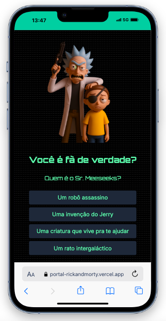

# 🌌 Portal Rick and Morty

Um projeto interativo e gamificado feito com React + Vite + TailwindCSS, inspirado no multiverso de Rick and Morty. Explore personagens, desbloqueie cards colecionáveis, filtre por espécies e planetas, e divirta-se com um visual dinâmico e responsivo!

[](https://opensource.org/licenses/MIT)
[](https://reactjs.org/)
[](https://portal-rickandmorty.vercel.app/)
[](https://github.com/juliabacchi1/portal-rickandmorty)



---

## 🛠️ Tecnologias

- [React](https://react.dev/)
- [Vite](https://vitejs.dev/)
- [TailwindCSS](https://tailwindcss.com/)
- [@dnd-kit](https://dndkit.com/)
- [Rick and Morty API](https://rickandmortyapi.com/)
- [Framer Motion](https://www.framer.com/motion/)
- [React Router](https://reactrouter.com/)

---

## 🧪 Instalação

```bash
git clone https://github.com/juliabacchi1/portal-rickandmorty.git
cd portal-rickandmorty
npm install
npm run dev
```

---

## 🚀 Funcionalidades

- 🔍 **Busca inteligente** com debounce
- 🌀 **Exploração de personagens** com filtros por espécie, status e planeta
- 🃏 **Galeria de cards colecionáveis** com drag & drop
- 🏆 **Sistema de gamificação** com conquistas e pontuação
- 🌍 **Transições visuais dinâmicas** entre universos
- 🎮 **Modo interativo** com quiz inspirado na série
- 🧠 **Frases do Rick** em mensagens de erro (404 etc)
- 🔗 **Compartilhamento de personagens** via URL
- ⚙️ **Acessibilidade aprimorada** com ARIA e navegação por teclado
- ⚡ **Lazy loading** para performance

## 📁 Estrutura do Projeto

```bash
src/
├── components/
│ ├── CardGallery.jsx
│ ├── CardUnlockedToast.jsx
│ ├── CharacterDisplay.jsx
│ ├── GameHUD.jsx
│ ├── GlitchCycleImage.jsx
│ ├── LevelUpToast.jsx
│ ├── LogoTransition.jsx
│ ├── QuizIntro.jsx
│ └── SearchInput.jsx
├── context/
│ └── GameContext.jsx
├── data/
│ └── rickQuotes.js
├── styles/
│ └── glitch.css
└── App.jsx         
└── Main.jsx        
```

## 🧩 Em desenvolvimento
- 🤖 **Integração com OpenAI API** para respostas no estilo do Rick
- 📜 Cards extras para novos níveis desbloqueados
- 🛠️ Adição de novas features e refinamento de detalhes

## 🧠 Sobre o Projeto
Esse projeto faz parte do meu portfólio como desenvolvedora front-end e foi criado para demonstrar habilidades em React, UX/UI, APIs, performance, acessibilidade e gamificação. Ele mistura humor, interatividade e referências à série de um jeito leve e visualmente marcante.

## 🙋‍♀️ Feito por
Julia Bacchi – desenvolvedora front-end apaixonada por inovação, sustentabilidade e boas ideias.
[LinkedIn](https://www.linkedin.com/in/juliabacchi/) | [Portfólio](https://juliadev.vercel.app/)

## 🪄 Contribuições
Quer contribuir com o projeto? Crie um fork, abra uma issue ou envie um pull request. Toda ajuda é bem-vinda! 💛

## 📄 Licença
MIT © Júlia Bacchi
